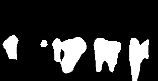
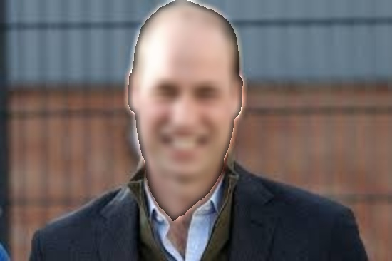
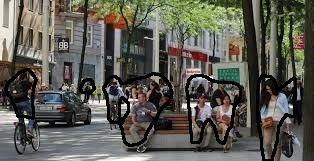

# seg_mask_modifs

[](https://hits.seeyoufarm.com)

## Description
A package for easy generation of binary semantic mask of different labels using multiple models easily. Moreover, supports operations on the mask created for image editing.

#### Curent models and labels supported:
- Deeplabv3 with pascal labels
- Maskrcnn with coco labels
- Bisnet with face labels

## Usage

### Installation
pip:
```
pip install seg-mask-modifs
pip install opencv-contrib-python>=4.5.4.60
# if you install opencv-python then inpainting won't work
```

Cloning repo then install requirements:
```
pip install -r requirements.txt
```

### Documentation

The documentation of the different classes and functions is available [here](https://vardanagarwal.github.io/seg_mask_modifs.html)

### Usage

### Download models
[Documentation page](https://vardanagarwal.github.io/seg_mask_modifs/download_models.html)

The models can be downloaded seperately or all of then can be downloaded at once.

```
from seg_mask_modifs import download_models

download_models.download_all() # download all models with default names which is highly recommended.

download_models.maskrcnn_coco(save_path='models/maskrcnn_restnet50_fpn.pt') # download maskrcnn model with coco labels
download_models.deeplab_pascal() # download deeplab model
download_models.face() # download bisnet face model
```

### Labels
[Documentation page](https://vardanagarwal.github.io/seg_mask_modifs/print_labels.html)

To see the list of labels supported by the package, this function can be used.

```
from seg_mask_modifs import print_labels

print_labels.all() # prints all labels

print_labels.deeplab_pascal() # prints pascal labels
print_labels.maskrcnn_coco() # prints coco labels
print_label.face() # prints face labels
```

### Mask Generation
[Documentation page](https://vardanagarwal.github.io/seg_mask_modifs/mask_generator.html)

Class to generate binary mask for any combination of labels. The models will be automatically used according to model preference and labels provided.

```
import cv2
from seg_mask_modifs import mask_generator

mask_gen = mask_generator.mask_generator(threshold=0.5, auto_init=True) # auto_init will only work if the models are saved to the default path.

# if auto_init is false or different path used to save model initialize them manually.
mask_gen.init_maskrcnn('maskrcnn.pt')
mask_gen.init_deeplab('deeplab.pt')
mask_gen.init_face('face.pth')

img = cv2.imread('images/city.jpg')
mask = mask_gen.generate(img=img, labels=['person', 'suitcase'])
```

In the example above the test image passed is:


This generates the following output, using deeplabv3 for person and maskrcnn for suitcase:



To generate mask use only one model, the use_model argument can be used.
```
mask = mask_gen.generate(img=img, labels=['person', 'suitcase'], use_model='maskrcnn')
```

By default, the deeplab model has the highest priority followed by maskrcnn and then bisnet face model. Any label which is supported by more than model will be generated by the one with higher preference. To check the model preference:

```
mask_gen.print_model_preference() 
```

To change the model preference:
```
mask_gen.set_model_preference(model_list['maskrcnn', 'face', 'deeplab'])
mask_gen.set_model_preference(model='face', pos=0)
```
The model preference can be set using a list, or giving a particular model a particular position. 
Note: if model is not found in the list, it will be ignored.

### Mask Utilities
[Documentation page](https://vardanagarwal.github.io/seg_mask_modifs/mask_utils.html)

Functions to combine, invert, dilate, etc. on multiple masks at once. Take a look at the documentation for more details.

### Mask Modifications
[Documentation page](https://vardanagarwal.github.io/seg_mask_modifs/mask_modifier.html)

Functions to modify masks. Includes various operations like blurring, pixelaing, replacing, inpainting the background and foreground among other operations. Take a look at the documentation for complete details. Some examples are given below.

#### Blurring Foreground


#### Drawing outline


#### Pixelate foreground


#### Grayscale background


## References
1. Face parsing: https://github.com/zllrunning/face-parsing.PyTorch
2. Mask-RCNN: https://pytorch.org/vision/stable/_modules/torchvision/models/detection/mask_rcnn.html
3. Deeplabv3: https://pytorch.org/vision/main/_modules/torchvision/models/segmentation/deeplabv3.html
